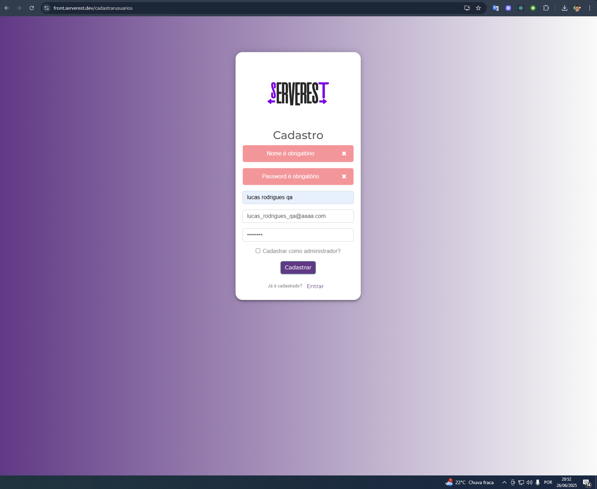

# Bugs Encontrados

Este arquivo documenta os bugs encontrados durante a execução dos testes automatizados.

## BUG-001: VALIDAÇÃO DE CAMPOS OBRIGATÓRIOS COM EMAIL MODIFICADO

### Descrição
Ao tentar cadastrar um usuário que já está cadastrado no bd, é acusado o erro "Email já está sendo usado", mas quando adicionado um caractere aleatório (tornando o email válido), o sistema então acusa que os campos nome e senha não estão preenchidos, mesmo estando preenchidos corretamente.

### Passos para Reproduzir
1. Acessar a tela de cadastro
2. Preencher nome, email (de um usuário já cadastrado) e senha
3. Clicar em cadastrar
4. Receber mensagem "email já está sendo usado"
5. Modificar o email adicionando um caractere aleatório
6. Clicar em cadastrar novamente
7. Sistema acusa que nome e senha não estão preenchidos

### Comportamento Esperado
- Ao modificar o email para um não cadastrado, o sistema deveria permitir o cadastro normalmente
- Os campos nome e senha deveriam manter seus valores preenchidos

### Comportamento Atual
- Sistema valida incorretamente que não tem dados no campo.
- Exibe mensagens de erro incorretas para campos obrigatórios

### Evidência

### Status
- [ ] Reproduzido
- [ ] Reportado
- [ ] Em análise
- [ ] Corrigido
- [ ] Testado

---

*Nota: Este arquivo será atualizado conforme novos bugs forem identificados.* 