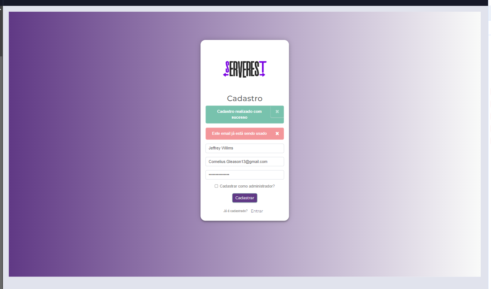

# Regras de Negócio - Cadastro

Este documento define as regras de negócio para o processo de cadastro de usuários.

## 1. Campo Email

### 1.1 Validações de Formato
- **1.1.1** Não pode conter `.`, `-` ou `_` no começo ou no fim do corpo do email
  - ❌ `.lucas@email.com`
  - ❌ `lucas.@email.com`
  - ❌ `-lucas@email.com`
  - ❌ `lucas-@email.com`
  - ❌ `_lucas@email.com`
  - ❌ `lucas_@email.com`
  - ✅ `lucas@email.com`

- **1.1.2** Não pode conter `.`, `-` ou `_` juntos (consecutivos)
  - ❌ `lucas..rodrigues@email.com`
  - ❌ `lucas__rodrigues@email.com`
  - ❌ `lucas--rodrigues@email.com`
  - ❌ `lucas._rodrigues@email.com`
  - ❌ `lucas.-rodrigues@email.com`
  - ✅ `lucas.rodrigues@email.com`
  - ✅ `lucas_rodrigues@email.com`
  - ✅ `lucas-rodrigues@email.com`

- **1.1.3** Deve seguir a máscara `texto@texto.texto`
  - ❌ `lucas@email`
  - ❌ `lucas@.com`
  - ❌ `@email.com`
  - ❌ `lucas@email.`
  - ✅ `lucas@email.com`
  - ✅ `lucas@email.com.br`
  - ✅ `lucas@email.co.uk`

## 2. Campo Nome

### 2.1 Validações de Formato
- **2.1.1** Pode conter apenas 1 caracter
  - ✅ `A`
  - ✅ `1` 
  - ✅ `!`

- **2.1.2** Deve conter no máximo 100 caracteres
  - ❌ Nome com mais de 100 caracteres
  - ✅ Nome com até 100 caracteres

- **2.1.3** Deve conter apenas letras, espaços e caracteres especiais permitidos
  - ✅ `João Silva`
  - ✅ `Maria das Dores`
  - ✅ `José da Silva Santos`
  - ❌ `João123`
  - ❌ `Maria@Silva`

- **2.1.4** Não pode conter espaços consecutivos
  - ❌ `João  Silva`
  - ❌ `Maria   das Dores`
  - ✅ `João Silva`
  - ✅ `Maria das Dores`

- **2.1.5** Não pode começar ou terminar com espaço
  - ❌ ` João Silva`
  - ❌ `João Silva `
  - ✅ `João Silva`

## 3. Campo Senha

### 3.1 Validações de Formato
- **3.1.1** Deve conter pelo menos 6 caracteres
  - ❌ `12345`
  - ✅ `123456`
  - ✅ `senha123`

- **3.1.2** Deve conter no máximo 50 caracteres
  - ❌ Senha com mais de 50 caracteres
  - ✅ Senha com até 50 caracteres

- **3.1.3** Deve conter pelo menos uma letra maiúscula
  - ❌ `senha123`
  - ✅ `Senha123`
  - ✅ `SENHA123`

- **3.1.4** Deve conter pelo menos uma letra minúscula
  - ❌ `SENHA123`
  - ✅ `Senha123`
  - ✅ `senha123`

- **3.1.5** Deve conter pelo menos um número
  - ❌ `Senha`
  - ✅ `Senha123`
  - ✅ `123Senha`

- **3.1.6** Pode conter caracteres especiais (opcional)
  - ✅ `Senha@123`
  - ✅ `Senha#123`
  - ✅ `Senha$123`

## 4. Validações Gerais

### 4.1 Campos Obrigatórios
- Todos os campos (nome, email, senha) são obrigatórios
- Não é possível cadastrar com campos vazios

### 4.2 Unicidade de Email
- Cada email pode ser cadastrado apenas uma vez
- Não é possível cadastrar dois usuários com o mesmo email

### 4.3 Tipo de Usuário
- Usuário pode ser cadastrado como normal ou administrador
- A opção "Cadastrar como administrador" é opcional

## 5. Melhorias Sugeridas

### 5.1 Campo Nome - MaxLength
- **Problema**: O campo nome aparece na mensagem "Bem Vindo [nome]" para usuários admin
- **Risco**: Nomes muito longos podem quebrar o layout da interface
- **Solução**: Implementar `maxlength` no campo nome para limitar o tamanho
- **Benefício**: Garante que a mensagem de bem-vindo sempre se ajuste ao layout
- **Recomendação**: Limitar a 50 caracteres para garantir compatibilidade com a interface

### 5.2 Comportamento de Double Submit

- **Problema**: Ao clicar duas vezes rapidamente no botão "Cadastrar", o sistema retorna **duas mensagens**:  
  - ✅ "Cadastro realizado com sucesso"  
  - ❌ "Este email já está sendo usado"
- **Risco**: Isso pode causar confusão para o usuário, erros de concorrência ou comportamento imprevisível na base de dados
- **Solução sugerida**:
  - Desabilitar o botão durante o envio
  - Implementar debounce de 1 segundo
- **Evidência**:

---
---

*Nota: Estas regras devem ser validadas tanto no frontend quanto no backend.* 